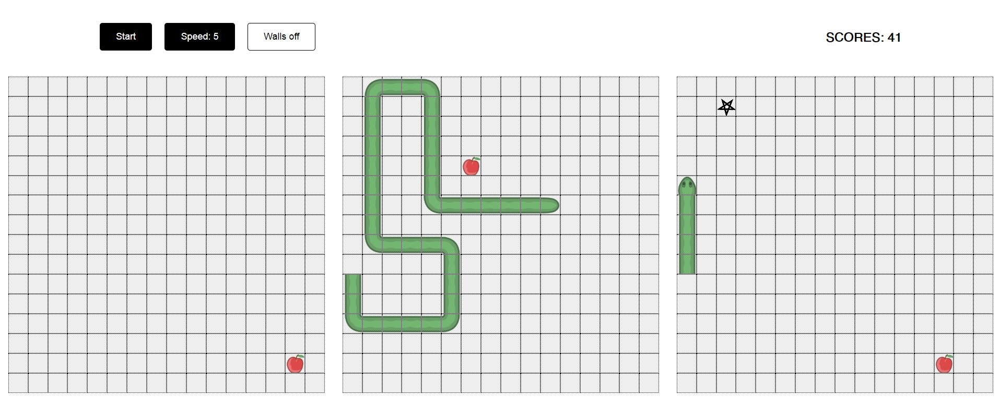

# snake-teleport
Игра «Змейка» с несколькими полями
### Особенности
---
- адаптируется под размер экрана
- два варианта игры - с обычным и тороидальными полями
- змейка может перемещаться на другое поле через телепорт
- 10 скоростей
- гибкие настройки в коде
- управление через клавиатуру, кнопки курсора
---
### [демо ➫](https://avavax.ru/src/1004/)

